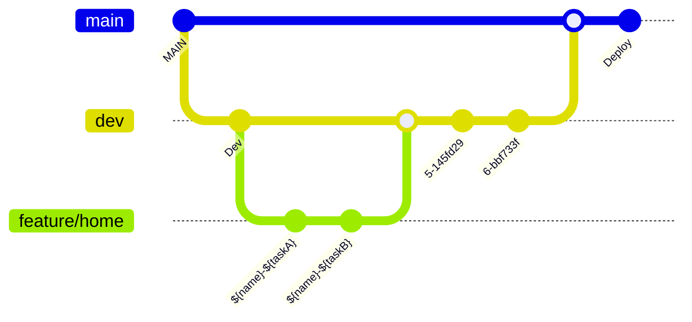

# PICO

## ＞ Branch Convention

## 팀원

<!-- 최하늘 -->
  

    <h3>최하늘</h3>
    

    
    

    
<a href="https://github.com/HANLeeeee">최하늘 깃허브</a>

  

  
<!-- 김민기 -->
  

    <h3>김민기</h3>
    

    
    

    
<a href="https://github.com/minki-kim-git">김민기 깃허브</a>

  

<!-- 방유빈 -->
  

    <h3>방유빈</h3>
    

    
    

    
<a href="https://github.com/bangtori">방유빈 깃허브</a>

  

<!-- 신희권 -->
  

    <h3>신희권</h3>
    

    
    

    
<a href="https://github.com/hhh131">신희권 깃허브</a>

  

  

    <h3>양성혜</h3>
    

    
    

    
<a href="https://github.com/seongzzang">양성혜 깃허브</a>

  

<!-- 오영석 -->
  

    <h3>오영석</h3>
    

    
    

    
<a href="https://github.com/Youngs5">오영석 깃허브</a>

  

<!-- 이제현 -->
  

    <h3>이제현</h3>
    

    
    

    
<a href="https://github.com/LJH3904">이제현 깃허브</a>

  

<!-- 임대진 -->
  

    <h3>임대진</h3>
    

    
    

    
<a href="https://github.com/DAEJINLIM">임대진 깃허브</a>

  

