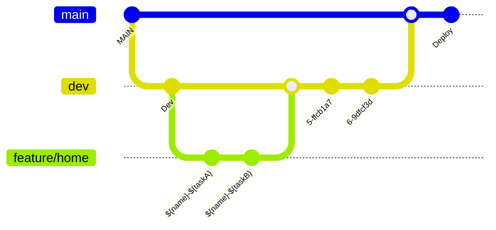

# PICO (Pick & Connect)


- 나와 맞는 사람을 Pick 하고 나와 잘 맞는 사람들과 Connect
- MBTI(마이어스-브릭스 유형 지표)를 활용한 매칭 시스템을 통해 사용자 간 커뮤니케이션을 지원는 APP
  
<br/><br/><br/>

## 📌 앱 소개 영상
https://youtu.be/efr4abi4cTk

<br/><br/><br/>

## 📌 구동 화면

<table align="center">
  <tr>
    <th>로그인/회원가입</th>
    <th>추천</th>
    <th>필터</th>
    <th>쪽지</th>
    <th>매칭</th>
  </tr>
  <tr>
    <td>
    <td></td>
    <td></td>
    <td></td>
    <td></td>
  </tr>
</table>

<table align="center">
  <tr>
    <th>푸시알림</th>
    <th>이상형 월드컵</th>
    <th>랜덥 박스</th>
    <th>마이페이지</th>
    <th>관리자모드</th>
  </tr>
  <tr>
    <td></td>
    <td>
    <td></td>
    <td></td>
    <td></td>
  </tr>
</table>


<br/><br/><br/>

  
## 📌 설치 / 실행 방법
1. 아래 파일은 필수 파일이므로 다음 이메일로 파일을 요청해주세요. (rlaalsrl1227@gmail.com)  
```
- GoogleService-Info.plist
- APIKeys.plist
- YOLOv3.mlmodel
```
2. Pico.xcodeproj 파일 실행을 해주세요.
3. Config 폴더에 필수파일을 추가한 뒤 빌드해주세요.

<br/><br/><br/>

## 📌 사용자 메뉴얼
[사용자메뉴얼.pdf](https://github.com/APPSCHOOL3-iOS/final-pico/files/13216388/default.pdf)


<br/><br/><br/>


## 📌 개발 도구 및 기술 스택
<p align="leading">
  
    
  
</p>

- 개발 언어 : Swift
- 개발 환경 : Xcode 15.0.1
- 실행 환경 : iOS 15.0 이상
- 디자인 툴 : Figma
- 협업 도구 : Github, Team Notion
- 활용한 기술
  - Xcode
  - SwiftLint, RxSwift, SnapKit, Kingfisher, Lottie
  - YoLoV3
  - FCM, Naver Cloud SMS API
  - FiresStore, Firebase Storage
  - DarkMode, VoiceOver


<br/><br/><br/>


## 📌 Folder Convention
```
📦 PICO
+-- 🗂 Config
+-- 🗂 UserDefaults 
+-- 🗂 Extention 
|    +-- 🗂 Namespace
|    +-- 🗂 UI
|    +-- 🗂 Data
+-- 🗂 Service
+-- 🗂 Common
|    +-- 🗂 Constraints
|    +-- 🗂 View
|    +-- 🗂 Transition
+-- 🗂 Utils 
+-- 🗂 Model 
+-- 🗂 Sign 
|    +-- 🗂 SignIn
|    +-- 🗂 SignUp
+-- 🗂 TabBar
+-- 🗂 Home
|    +-- 🗂 Detail 
+-- 🗂 Mail
+-- 🗂 Like
+-- 🗂 Ent
+-- 🗂 MyPage
|    +-- 🗂 RandomBox
|    +-- 🗂 ProfileEdit
|    +-- 🗂 Setting
|    |    +-- 🗂 SettingDetail
|    +-- 🗂 Store
+-- 🗂 Notification
+-- 🗂 Admin
```

<br/><br/><br/>

## 📌 Branch Convention


<br/><br/><br/>


## 📌 참여자
<table align="center">
  <tr>
    <th>최하늘</th>
    <th>김민기</th>
    <th>방유빈</th>
    <th>신희권</th>
    <th>양성혜</th>
    <th>오영석</th>
    <th>이제현</th>
    <th>임대진</th>
  </tr>
  <tr>
    <td></td>
    <td></td>
    <td></td>
    <td></td>
    <td></td>
    <td></td>
    <td></td>
    <td></td>
  </tr>
  <tr>
    <td><a href="https://github.com/HANLeeeee">최하늘 깃허브</a></td>
    <td><a href="https://github.com/minki-kim-git">김민기 깃허브</a></td>
    <td><a href="https://github.com/bangtori">방유빈 깃허브</a></td>
    <td><a href="https://github.com/hhh131">신희권 깃허브</a></td>
    <td><a href="https://github.com/seongzzang">양성혜 깃허브</a></td>
    <td><a href="https://github.com/Youngs5">오영석 깃허브</a></td>
    <td><a href="https://github.com/LJH3904">이제현 깃허브</a></td>
    <td><a href="https://github.com/DAEJINLIM">임대진 깃허브</a></td>
  </tr>
</table>
