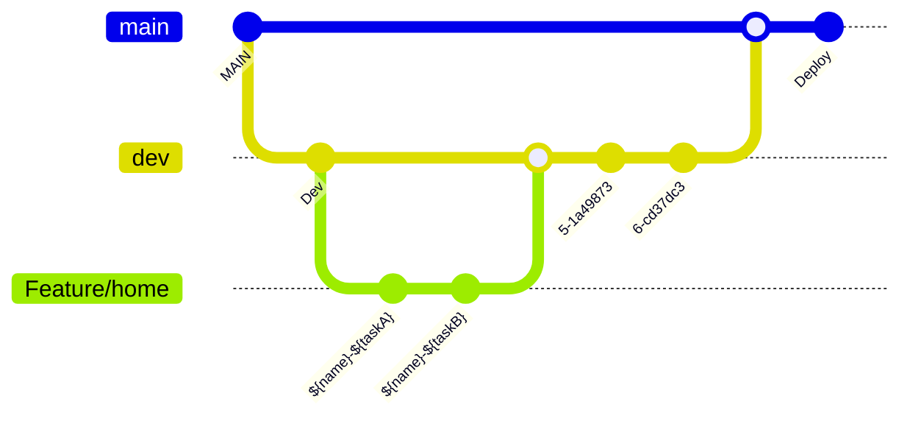

# PICO

## ＞ Branch Convention

```mermaid
gitGraph
    commit id: "MAIN"
    branch dev
    checkout dev
    commit id: "Dev"
    branch Feature/home
    checkout Feature/home
    commit id: "${name}-${taskA}"
    commit id: "${name}-${taskB}"
    checkout dev
    merge Feature/home
    commit
    commit
    checkout main
    merge dev
    commit id: "Deploy"
    
```
